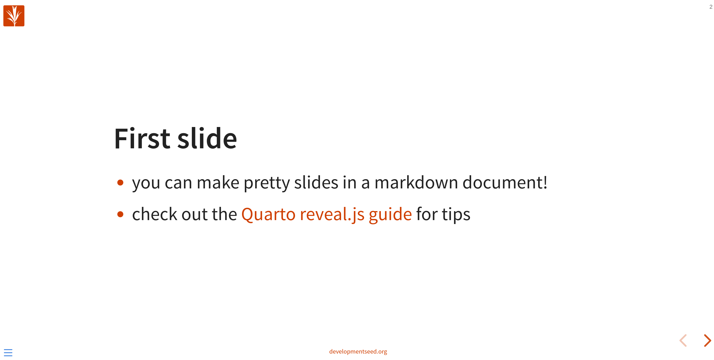
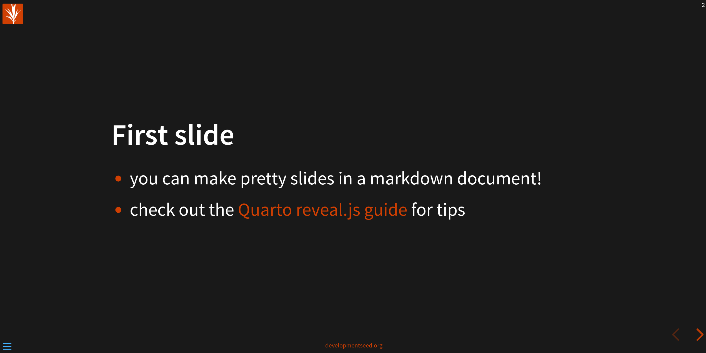

# quarto-reveal.js-presentation-template
A template for creating a presentation with Quarto and reveal.js

**light theme**


**dark theme**


## How to use this template

1. Create a new repository from this template and clone it to your local environment

2. Install quarto

3. Run `quarto publish gh-pages` to set up a `gh-pages` branch and configure the github pages deployment.

4. Enable publish actions
  - Uncomment the `publish` step in [.github/workflows/quarto-publish.yml] to enable publishing to Github Pages on pushes to main. It will push to the `gh-pages` branch and the presentation will be published to https://developmentseed.github.io/{repo_name}
  - Uncomment the `publish` step in [.github/workflows/quarto-preview.yml](./.github/workflows/quarto-preview.yml) to enable publishing pull request previews to Github Pages
  - push to the remote repository

## Slides in markdown??

- [`index.md`](./index.md) is where you can edit all slide content. There is a pretty comprehensive guide to using markdown for a reveal.js presentation in the [Quarto docs](https://quarto.org/docs/presentations/revealjs/).
- You could also use an `.ipynb` or `.qmd` file if you want to actually run code to generate content for slides but you can keep it real simple by just using markdown.

## Custom theme
- By default the theme is set to reveal.js `white` theme. For a dark theme try `black` in the yaml header of `index.md`.
- [styles.css](./styles.css) has css rules for some of the style elements which allows us to orange things up a bit.


## Local development
You can run a local preview of the presentation with `quarto preview`. This will load a live preview of the presentation as you work on it. If you want to execute code, you can set up a virtual environment with `uv`:
  ```bash
  uv venv && uv sync
  ```
Then you can run quarto with the virtual environment:
  ```bash
  uv run quarto preview .
  ```
