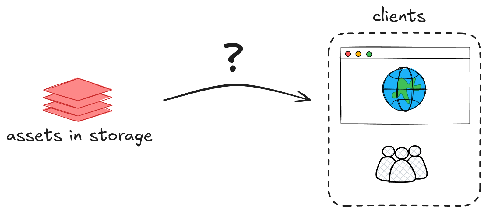
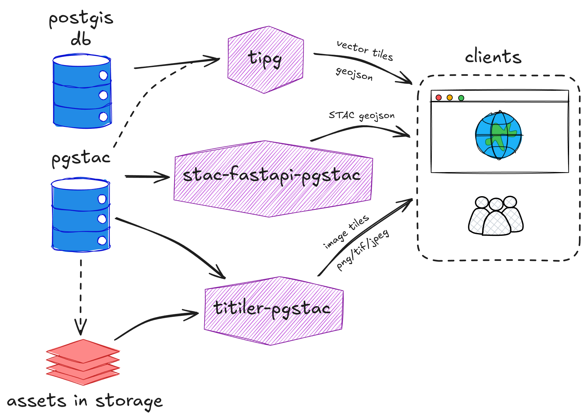
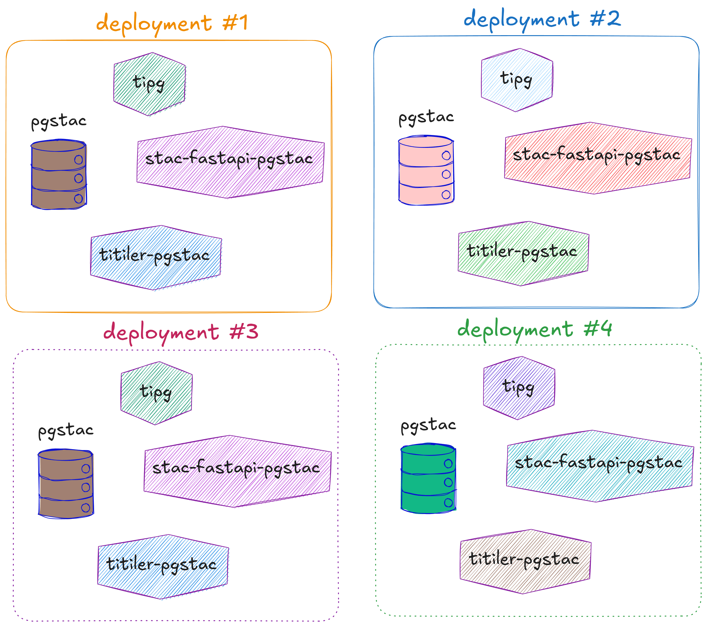
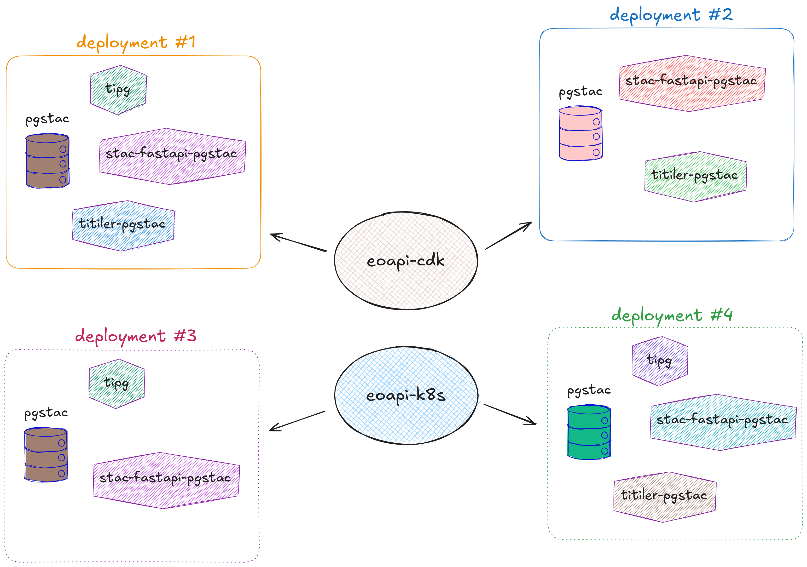

# what even is eoAPI?

##
{.r-stretch}

##
{.r-stretch}

##

{.r-stretch}

::: {.notes}
You might want to use eoAPI if...

- you have geospatial data that you want to serve to client applications
- depending on the data formats and visualization needs, eoAPI could be a helpful building block
- you are a geospatial person not an infrastructure wizard
:::

##

{.r-stretch}

::: {.notes}
- makes the configuration of these components 'importable'

- "years of wisdom baked into one tool" - @ali
:::

##

{.r-stretch}

##

{.r-stretch}

# eoapi-cdk update

- "the serverless* deployment option"

- recently upgraded to latest versions of component runtimes

- up to v8.3.0 as of July 3 2025

## exciting developments

- `pgbouncer` connection pooling

- event-driven STAC item/collection loading infrastructure

  - S3 events + SNS + SQS + Lambda

- simplified default runtimes to improve maintainability

- future improvements:

  - Lambda SnapStart runtime: reduces titiler-pgstac cold start time from ~6.4 seconds to ~1.5 seconds [[ref](https://github.com/developmentseed/eoapi-cdk/issues/149)]

::: aside
[https://github.com/developmentseed/eoapi-cdk/releases](https://github.com/developmentseed/eoapi-cdk/releases)
:::

# eoapi-k8s update

- lots of TLC in recent months!

- upgraded to latest versions of component runtimes

- up to v0.7.4 as of July 1 2025

- so much work from so many projects feeding back into the core library

::: {.notes}
- It is great to see so much activity from recent projects flowing through eoapi-k8s
:::

## exciting developments

- Unified Database Architecture

- Ingress System Improvements

- Service Architecture Enhancements

- New features:

  - Integrated STAC Browser
  
  - Azure secret vault integration
  
  - ArtifactHub.io integration

  - in development: stac-auth-proxy integration!

::: footer
[https://github.com/developmentseed/eoapi-k8s/releases](https://github.com/developmentseed/eoapi-k8s/releases)
:::

# eoAPI in the wild

- Felix started a [survey](https://docs.google.com/document/d/1eqgYPGC31RXLHf9FOTwzdH1r8RqNw1GjkXD42bsJKPg/edit?tab=t.0) to summarize known deployments 

- ~12 deployments that DevSeed is involved with
  
  - 7 eoapi-k8s, 5 eoapi-cdk

- WAG: probably dozens of deployments that DevSeed is not involved with

## Anecdotes

## sensible defaults FTW

  - makes it easy to quickly demonstrate the capabilities of eoAPI

## Kudos

  - the eoapi-k8s team is on a roll! 

  - @emmanuel is doing an amazing job pushing the limits of eoapi-k8s, Montandon + IFRC is an excellent example
  
  - @ali provided some excellent feedback from recent deployment experience

  - @gadomski and @yellowcap have been doing a great job flagging helpful features for new projects

# Next steps

## documentation

- Improve documentation to highlight differences between eoapi-cdk and eoapi-k8s

  - provide guidance on the main structural differences: cost, flexibility, etc
  
  - they have different features, different developers, etc

## workshops

- planned/completed

  - FedGeoDay 2025: [eoapi-fedgeoday25-workshop](https://github.com/developmentseed/eoapi-fedgeoday25-workshop)

  - [upcoming] FOSS4GNA

- Virtual Workshop? 
  - greater reach than in-person, easier to record and share

# Thank you!
